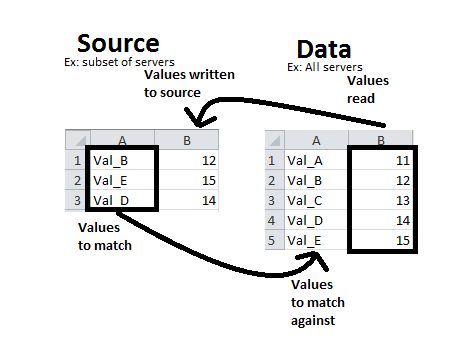

# ExcelAssistant

A python program to match values to data from two different excel files.

On windows, run build.bat to build an exe file. Run clean.bat to delete the files that build.bat generates.
